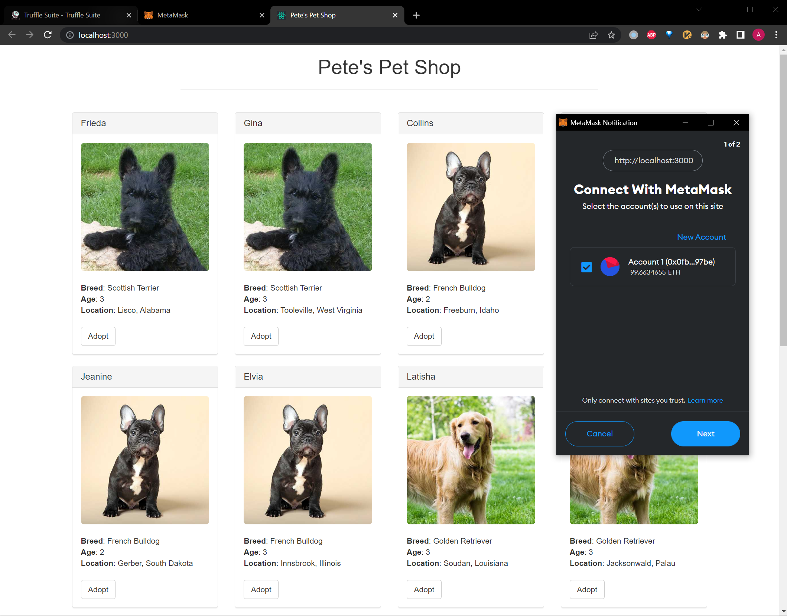
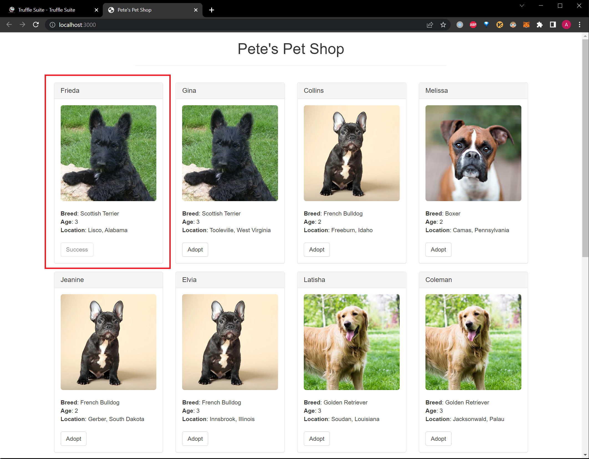

# Pet Shop

## How to start

### 1. Prerequisites
- Node.js v8+ LTS, npm
- Git
- truffle
- ganache
- A browser, MetaMask browser extension

### 2. Start

1. Start Ganache

2. Compile and deploy contracts to Ganache
    ```
    truffle compile
    truffle migrate
    ```

3. Build and start frontend

    ```
    npm install
    npm dev
    ```

4. In MetaMask, import the wallet using Ganache mneumonic and select an account to use in the web site.



5. Adopt a pet and pay the gas fee.

