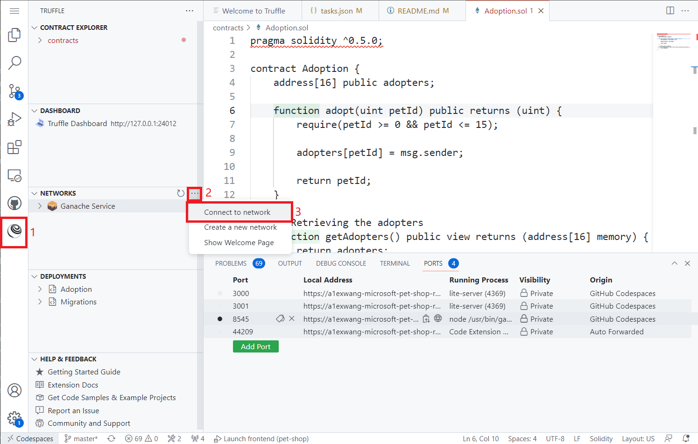
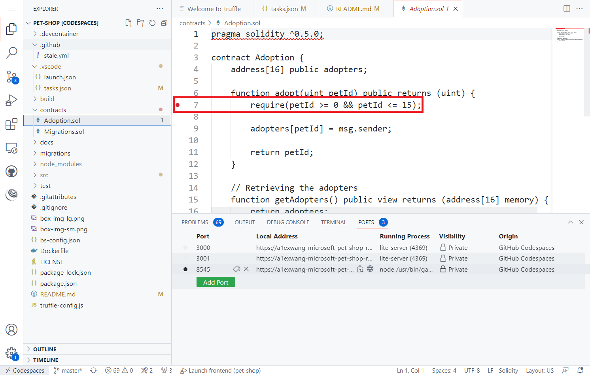
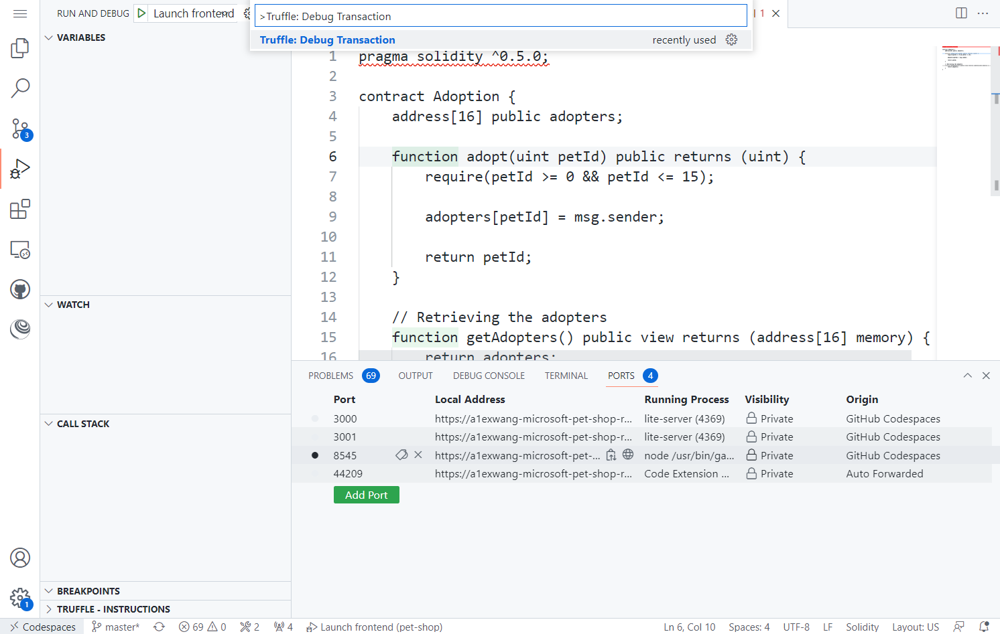
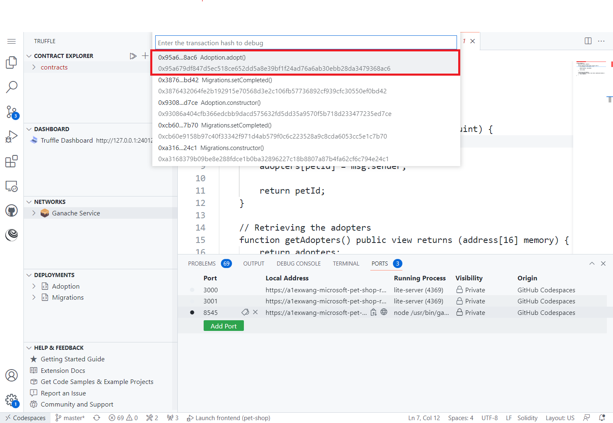

# NFT

A non-fungible token (NFT) is a record on a blockchain which is associated with a particular digital or physical asset. 

This repo will enable you to build a simple NFT marketplace like [opensea.io](https://opensea.io/) with Truffle, Ganache and NodeJS as frontend.

Here is a screen shot of the DApp running.

## Getting Started

Create Codespaces on main branch and start.

Run your app with local debugging by pressing `F5` in VSCode. Or `Run and Debug` and select `Launch frontend`.

**Congratulations**! You are running an NFT marketplace that users can get a Free NFT as giveaways.

## Understanding the code

This section walks through the generated code. The project folder contains the following:

| Folder | Contents |
| - | - |
| `.vscode` | VSCode files for local debug |
| `contracts` | The Solidity source files for NFT smart contracts |
| `migrations` | Migration system is used to handle smart contract deployments. A migration is an additional special smart contract that keeps track of changes. |
| `src` | Frontend code to contain the DApp |
| `test` | Contains both JavaScript and Solidity tests for the smart contracts |

## Debug Transactions

**Truffle** VS Code Extension is pre-installed in the container. After the NFT app is started and a pet is adopted, you can debug (replay) existing transactions.

The steps to debug transactions are:

1. Click three dots in the "NETWORKS" tree view in Truffle extension.
1. Select `Connect to network` and select `Ganache service` in the quick pick.

1. Enter `8545` in the quick pick. Ganache runs on this port by default.
1. You can set breakpoints in Solidity smart contract code. For example, set a breakpoint in `adopt` function in `Adoption.sol`.

1. Hit `Ctrl + P` to open the command pallete and input and select "Truffle: Debug Transaction".

1. Select a previouly run transaction to replay.

1. You can now step debugging in Solidity code and check values of variables.

## TODO: How to check transaction/accounts using CLI/dashboard
