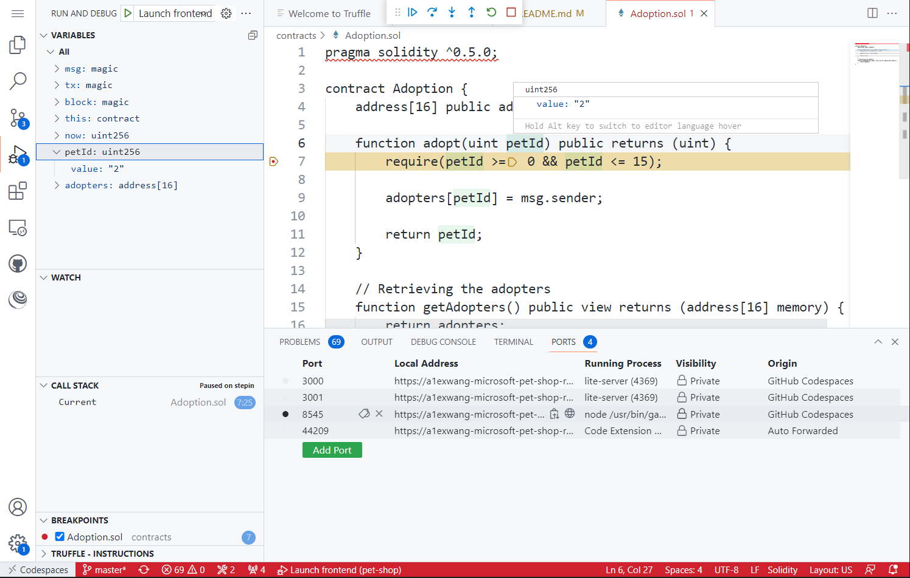

# Pet Shop

## Start the App

1. Click F5 to start the pet shop app.

## Debug Transactions

**Truffle** VS Code Extension is pre-installed in the container. After the pet shop app is started and a pet is adopted, you can debug (replay) existing transactions.

The steps to debug transactions are:

1. Click three dots in the "NETWORKS" tree view in Truffle extension.
1. Select `Connect to network` and select `Ganache service` in the quick pick.

1. Enter `8545` in the quick pick. Ganache runs on this port by default.
1. You can set breakpoints in Solidity smart contract code. For example, set a breakpoint in `adopt` function in `Adoption.sol`.

1. Hit `Ctrl + P` to open the command pallete and input and select "Truffle: Debug Transaction".

1. Select a previouly run transaction to replay.

1. You can now step debugging in Solidity code and check values of variables.

## TODO: How to check transaction/accounts using CLI/dashboard
